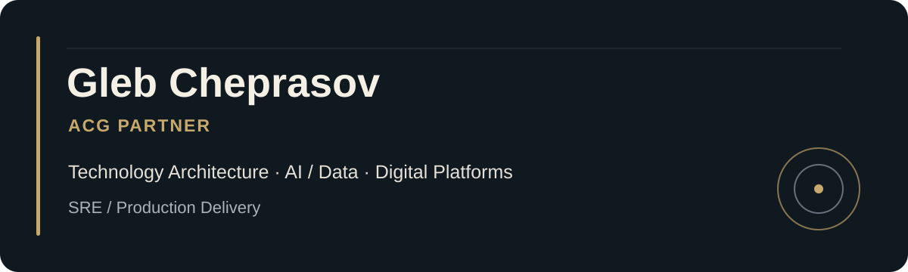

# Gleb Cheprasov

**ACG Partner | Head of Technology Architecture, AI/Data & Digital Platforms**

> Technology architect and engineering leader focused on AI/Data platforms, digital systems, SRE, and production-grade delivery.

[Avdyushin Consulting Group](https://avdyushin-ru.vercel.app/ru) · [Telegram](https://t.me/Cokol888) · [LinkedIn](https://clck.ru/3RbcBJ) · [Email](mailto:gleb.kak2@yandex.ru)

## About

I have more than 10 years of experience across technology architecture, AI/Data, and the operation of digital solutions. My work combines engineering accountability with technical leadership: connecting business objectives, architecture, data, AI, security, reliability, and delivery.

I design and guide solutions through the full lifecycle—from discovery and architecture assessment to proof of concept, production deployment, observability, adoption, and continuous improvement. The emphasis is on measurable outcomes, explicit quality criteria, reliable systems, and operations that teams can govern and sustain.

## Focus Areas

- **Technology Architecture** — Target architecture, distributed systems, digital platforms, integrations, API and service boundaries, and architecture governance.
- **AI / GenAI** — LLM applications, RAG, AI agents, AI Search, evaluation, quality gates, and production AI systems.
- **Data Platforms** — Data architecture, data lakes, ETL/ELT, analytical models, data quality, and integration pipelines.
- **SRE / Platform Engineering** — Observability, incident management, reliability, CI/CD, automation, and production operations.

## Engineering and Delivery Stack

The stack below reflects the technologies and practices I use across architecture, delivery, and governance; it is not intended to imply identical hands-on depth in every area.

| Area | Technologies and practices |
| --- | --- |
| **Architecture** | Digital platforms, distributed systems, APIs, integrations, service boundaries, Azure, roadmaps |
| **AI / Data** | Python, LLM, RAG, AI agents, Azure AI Search, Azure Machine Learning, ETL/ELT, Data Lake |
| **Platform & Reliability** | SRE, DevOps, CI/CD, observability, incident management, automation |
| **Delivery & Governance** | Agile, Scrum, Jira, Confluence, architecture governance, KPIs, quality gates |

## Selected Industry Experience

### Large-Scale Infrastructure / NDA

Architecture of an AI-agent orchestration layer and data platform designed to automate SRE workflows across large-scale infrastructure. The organization and protected implementation details remain undisclosed.

### Geological Expertise

Participation in the architecture and development of **GeoExpert AI**, an AI-assisted environment for reviewing geological reports and supporting domain experts.

### Healthcare

AI-agent solutions for employee training, initial request processing, service routing, and quality control within healthcare workflows.

### Education and EdTech

Digital learning platforms with AI-assisted user support, progress monitoring, and operational learning workflows.

### Enterprise Digital Platforms

Architecture, integration, and delivery of internal digital systems, educational environments, and operational platforms.

## What I Deliver

- Architecture assessment, technical due diligence, and pragmatic target-state design.
- A controlled transition from an AI idea or pilot to a production-ready capability.
- Alignment of business goals with architecture, data, security, delivery, and operations.
- Quality gates and measurable criteria for technical and delivery decisions.
- Platform reliability, observability, and operating models suited to production use.
- Delivery roadmaps, implementation governance, and architecture and engineering advisory.

## Engagement Models

- **Architecture Review and Advisory** — Independent assessment, decision support, and a practical target-state roadmap.
- **AI/Data Discovery and Delivery** — Use-case framing, architecture, validation, and a governed path toward production.
- **Platform Reliability and SRE** — Reliability assessment and improvement of observability, incident practices, and automation.
- **Technical Leadership and Delivery Governance** — Architecture leadership, cross-team alignment, quality gates, and delivery oversight.

## Credentials

- Chief IT Expert for demonstration examinations in Moscow.
- Chair of State Examination Commissions for universities and colleges.
- Industry Expert within the Professional Skills movement.
- Member of an AI-focused certification commission.
- Degree in Information Systems and Technologies from Synergy University.
- Microsoft Azure certification or qualification work related to **AZ-305** and **AZ-400**.
- Professional education related to **Google Project Management**, **Google SRE**, **IBM AI Agents**, and **IBM Data Architecture**.

Certification references describe areas of completed qualification or professional education; no claim is made here about their current validity.

## Current Focus

Production-grade AI agents; AI evaluation and quality gates; enterprise RAG and AI Search; data and integration architecture; platform engineering; SRE automation; architecture governance; and digital platforms for regulated and knowledge-intensive industries.

## Collaboration

> Open to selected architecture advisory, AI/Data platform, technical due diligence and digital transformation engagements through Avdyushin Consulting Group.

## Contact

For professional enquiries, connect through [Avdyushin Consulting Group](https://avdyushin-ru.vercel.app/ru), [Telegram](https://t.me/Cokol888), or [LinkedIn](https://clck.ru/3RbcBJ).
